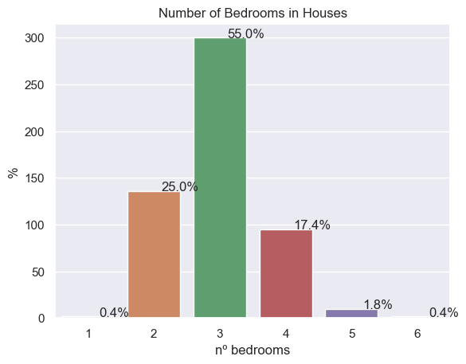
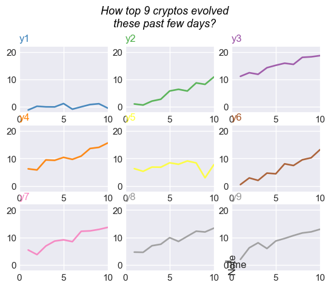
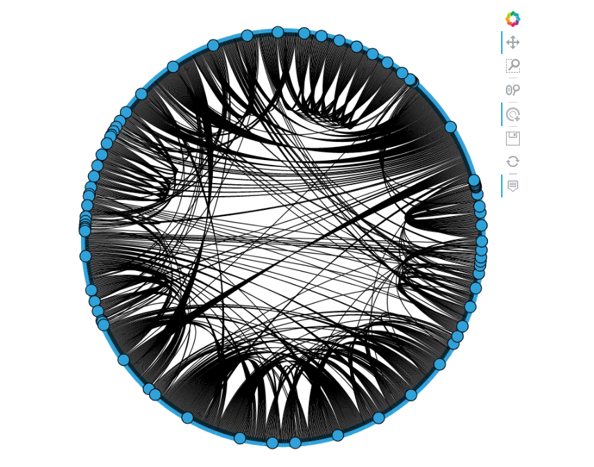

# PEC 2


### Javier Advani

#### Descripción y enunciado
En esta actividad el estudiante  tendrá que crear tres pequeñas visualizaciones usando técnicas diferentes que le serán asignadas, recibiréis un correo de vuestro profesor con la selección. Cada estudiante tendrá que escoger unos datos idóneos para cada una de las técnicas propuestas y decidir con qué software las crea. Los datos se podrán escoger de cualquier fuente de datos abiertos. El estudiante publicará las representaciones a Internet y las presentará en un video. El video deberá subirse a la zona llamada VideoPAC del aula.

Para publicar las representaciones os recordamos que hace falta que estas sean accesibles directamente con una URL, sin necesidad de registros ni inicios de sesión. Esto tanto se puede hacer en la misma plataforma donde se ha desarrollado la representación (Flourish, Tableau Public, Infogram, etc), como en un espacio gratuito como por ejemplo github, donde podéis crear un proyecto y publicar las representaciones en formato web a github.io, por ejemplo.(How to github.io)

Se trata de familiarizarse con técnicas de visualización y entender la esencia. De hecho, en lugar de ir de los datos a la visualización, en esta actividad lo hacemos a la inversa, es decir, a partir de cada técnica tenemos que ver para qué tipo de datos es adecuada y buscar un conjunto de datos que sea coherente, si puede ser sin tener que hacer ninguna transformación en los datos (para ahorraros trabajo).

A esta actividad hay que publicar las tres técnicas y un video explicativo que sigue el guión siguiente:

[Puntos 1 y 2] Presentaros siguiendo el esquema de la PEC 1.</br>
[Puntos 1 y 2: 5%] Indicad donde está colgada la visualización y cómo  acceder.</br>
[Punto 3: 30%] Definid cada técnica de visualización de forma general: nombre, origen, descripción/funcionamiento, ejemplos de aplicación, etc.</br>
[Punto 4: 10%] Describid el tipo de datos que se pueden representar con cada técnica (datos cuantitativos, cualitativas? Qué estructura tienen que tener para cada técnica?). Explicar las limitaciones en cuanto a datos (hay medida mínima y máxima del juego de datos para cada técnica?).</br>
[Punto 5: 20%] Hacer una representación con cada una de las técnicas usando un conjunto de datos abiertos (veáis más abajo algunas fuentes de datos abiertos). En total hay que hacer 3 representaciones simples con 3 conjuntos de datos escogidos por el estudiante.</br>
[Punto 6: 30%] Comentar brevemente las tres representaciones indicando qué se representa y qué o qué aspectos muestra o demuestra cada representación.</br>
[Punto 7: 5%] Cada una de las tres presentaciones deben tener una duración de unos 2-3 minutos. En total, el vídeo (único) con las tres técnicas no puede exceder de 7 minutos. Se penalizará salir de ese rango, porque se valora la capacidad de síntesis y de comunicación</br>

Algunas fuentes de datos abiertos:

1) COVID:
> Europa: https://www.ecdc.europa.eu/en/covid-19/data
> Cataluña: https://analisi.transparenciacatalunya.cat/es/browse?q=covid&sortby=relevance
> España: https://datos.gob.es/en/catalogo?q=covid&theme_id=salud&sort=metadata_created+desc

2)Portales Open Data :
> CAT: http://governobert.gencat.cat/ca/dades_obertes/
> ES: https://datos.gob.es/
> UK: https://data.gov.uk/
> USA: https://www.data.gov/
> AVE: https://data.gov.au/data

3) Otros:
> Data Sonification: https://sonification.design/
> RAW: https://app.rawgraphs.io/ -> Acceso a los datasets: https://github.com/rawgraphs/rawgraphs-app/tree/master/public/sample-datasets
> PAX: https://www.peaceagreements.org/
> Information is beutiful: https://informationisbeautiful.net/data/
> Kaggle: https://www.kaggle.com/datasets
> Directorio de datasets: https://www.dataquest.io/blog/free-datasets-for-projects/
> Google dataset search: https://datasetsearch.research.google.com/
> Gapminder: https://www.gapminder.org/data/

Recordad que en la  Biblioteca también tenéis acceso al recurso Statista y en el espacio de recursos de ciencia de datos de la UOC también podréis encontrar otras fuentes de datos:

https://datascience.recursos.uoc.edu/?filter=.cdades 

 

NOTA: Sobre los requisitos técnicos del vídeo para la entrega en VideoPAC: la herramienta soporta un tamaño máximo de 2GB y se pueden subir en cualquier formato, pero os recomendamos que uséis mp4 en resoluciones múltiplos de 360 (720, 1080…), para evitar problemas de transcodificación en la plataforma.

# 1. Bar Chart

A ```Bar graph``` is used when you want to show a distribution of categorical variables or ordinal subgroups of your data. From a bar chart, we can see which groups are highest or most common, and how other groups compare against the others.


```python
import pandas as pd
# fuente: https://www.kaggle.com/datasets/ashydv/housing-dataset/code
df = pd.read_csv('Housing.csv')
df.head()
```


<div>
<style scoped>
    .dataframe tbody tr th:only-of-type {
        vertical-align: middle;
    }

    .dataframe tbody tr th {
        vertical-align: top;
    }

    .dataframe thead th {
        text-align: right;
    }
</style>
<table border="1" class="dataframe">
  <thead>
    <tr style="text-align: right;">
      <th></th>
      <th>price</th>
      <th>area</th>
      <th>bedrooms</th>
      <th>bathrooms</th>
      <th>stories</th>
      <th>mainroad</th>
      <th>guestroom</th>
      <th>basement</th>
      <th>hotwaterheating</th>
      <th>airconditioning</th>
      <th>parking</th>
      <th>prefarea</th>
      <th>furnishingstatus</th>
    </tr>
  </thead>
  <tbody>
    <tr>
      <th>0</th>
      <td>13300000</td>
      <td>7420</td>
      <td>4</td>
      <td>2</td>
      <td>3</td>
      <td>yes</td>
      <td>no</td>
      <td>no</td>
      <td>no</td>
      <td>yes</td>
      <td>2</td>
      <td>yes</td>
      <td>furnished</td>
    </tr>
    <tr>
      <th>1</th>
      <td>12250000</td>
      <td>8960</td>
      <td>4</td>
      <td>4</td>
      <td>4</td>
      <td>yes</td>
      <td>no</td>
      <td>no</td>
      <td>no</td>
      <td>yes</td>
      <td>3</td>
      <td>no</td>
      <td>furnished</td>
    </tr>
    <tr>
      <th>2</th>
      <td>12250000</td>
      <td>9960</td>
      <td>3</td>
      <td>2</td>
      <td>2</td>
      <td>yes</td>
      <td>no</td>
      <td>yes</td>
      <td>no</td>
      <td>no</td>
      <td>2</td>
      <td>yes</td>
      <td>semi-furnished</td>
    </tr>
    <tr>
      <th>3</th>
      <td>12215000</td>
      <td>7500</td>
      <td>4</td>
      <td>2</td>
      <td>2</td>
      <td>yes</td>
      <td>no</td>
      <td>yes</td>
      <td>no</td>
      <td>yes</td>
      <td>3</td>
      <td>yes</td>
      <td>furnished</td>
    </tr>
    <tr>
      <th>4</th>
      <td>11410000</td>
      <td>7420</td>
      <td>4</td>
      <td>1</td>
      <td>2</td>
      <td>yes</td>
      <td>yes</td>
      <td>yes</td>
      <td>no</td>
      <td>yes</td>
      <td>2</td>
      <td>no</td>
      <td>furnished</td>
    </tr>
  </tbody>
</table>
</div>


```python
# Bar chart

import seaborn as sns
import matplotlib.pyplot as plt

sns.set(style="darkgrid")
total = float(len(df))
ax = sns.countplot(x="bedrooms", data=df)
for p in ax.patches:
    percentage = '{:.1f}%'.format(100 * p.get_height()/total)
    x = p.get_x() + p.get_width()
    y = p.get_height()
    ax.annotate(percentage, (x, y),ha='center')
ax.set(title="Number of Bedrooms in Houses", ylabel="%", xlabel= "nº bedrooms")
plt.show()
```


    

    


# 2. Small Multiple

A ```Small Multiple``` is a data visualization that consists of multiple charts arranged in a grid. This makes it easy to compare the entirety of the data. 


```python
# Small Multiple
import matplotlib.pyplot as plt
import numpy as np
import pandas as pd
 
df=pd.DataFrame({'x': range(1,11), 'y1': np.random.randn(10), 'y2': np.random.randn(10)+range(1,11), 'y3': np.random.randn(10)+range(11,21), 'y4': np.random.randn(10)+range(6,16), 'y5': np.random.randn(10)+range(4,14)+(0,0,0,0,0,0,0,-3,-8,-6), 'y6': np.random.randn(10)+range(2,12), 'y7': np.random.randn(10)+range(5,15), 'y8': np.random.randn(10)+range(4,14), 'y9': np.random.randn(10)+range(4,14) })
palette = plt.get_cmap('Set1')
num=0
for column in df.drop('x', axis=1):
    num+=1
    plt.subplot(3,3, num)
    plt.plot(df['x'], df[column], marker='', color=palette(num), linewidth=1.9, alpha=0.9, label=column)
 
    # Same limits for every chart
    plt.xlim(0,10)
    plt.ylim(-2,22)
 
    # Not ticks everywhere
    if num in range(7) :
        plt.tick_params(labelbottom='off')
    if num not in [1,4,7] :
        plt.tick_params(labelleft='off')
 
    # Add title
    plt.title(column, loc='left', fontsize=12, fontweight=0, color=palette(num) )

# general title
plt.suptitle("How top 9 cryptos evolved\nthese past few days?", fontsize=13, fontweight=0, color='black', style='italic', y=1.02)
 
# Axis titles
plt.text(0.5, 0.02, 'Time', ha='center', va='center')
plt.text(0.06, 0.5, 'Note', ha='center', va='center', rotation='vertical')

# Show the graph
plt.show()
```


    

    


# 3. Chord Diagram

The ``Chord`` element allows representing the inter-relationships between data points in a graph. The nodes are arranged radially around a circle with the relationships between the data points drawn as arcs (or chords) connecting the nodes. The number of chords is scaled by a weight declared as a value dimension on the ``Chord`` element.

If the weight values are integers, they define the number of chords to be drawn between the source and target nodes directly. If the weights are floating point values, they are normalized to a default of 500 chords, which are divided up among the edges. Any non-zero weight will be assigned at least one chord.

The ``Chord`` element is a type of ``Graph`` element and shares the same constructor. The most basic constructor accepts a columnar dataset of the source and target nodes and an optional value. Here we supply a dataframe containing the number of dialogues between characters of the *Les Misérables* musical. The data contains ``source`` and ``target`` node indices and an associated ``value`` column:


```python
import pandas as pd
import holoviews as hv
from holoviews import opts, dim
from bokeh.sampledata.les_mis import data

hv.extension('bokeh')
hv.output(size=200)
```


<style>.bk-root, .bk-root .bk:before, .bk-root .bk:after {
  font-family: var(--jp-ui-font-size1);
  font-size: var(--jp-ui-font-size1);
  color: var(--jp-ui-font-color1);
}
</style>


<div class="logo-block">
<img src='data:image/png;base64,iVBORw0KGgoAAAANSUhEUgAAAEAAAABACAYAAACqaXHeAAAABHNCSVQICAgIfAhkiAAAAAlwSFlz
AAAB+wAAAfsBxc2miwAAABl0RVh0U29mdHdhcmUAd3d3Lmlua3NjYXBlLm9yZ5vuPBoAAA6zSURB
VHic7ZtpeFRVmsf/5966taWqUlUJ2UioBBJiIBAwCZtog9IOgjqACsogKtqirT2ttt069nQ/zDzt
tI4+CrJIREFaFgWhBXpUNhHZQoKBkIUASchWla1S+3ar7r1nPkDaCAnZKoQP/D7mnPOe9/xy76n3
nFSAW9ziFoPFNED2LLK5wcyBDObkb8ZkxuaoSYlI6ZcOKq1eWFdedqNzGHQBk9RMEwFAASkk0Xw3
ETacDNi2vtvc7L0ROdw0AjoSotQVkKSvHQz/wRO1lScGModBFbDMaNRN1A4tUBCS3lk7BWhQkgpD
lG4852/+7DWr1R3uHAZVQDsbh6ZPN7CyxUrCzJMRouusj0ipRwD2uKm0Zn5d2dFwzX1TCGhnmdGo
G62Nna+isiUqhkzuKrkQaJlPEv5mFl2fvGg2t/VnzkEV8F5ioioOEWkLG86fvbpthynjdhXYZziQ
x1hC9J2NFyi8vCTt91Fh04KGip0AaG9zuCk2wQCVyoNU3Hjezee9bq92duzzTmxsRJoy+jEZZZYo
GTKJ6SJngdJqAfRzpze0+jHreUtPc7gpBLQnIYK6BYp/uGhw9YK688eu7v95ysgshcg9qSLMo3JC
4jqLKQFBgdKDPoQ+Pltb8dUyQLpeDjeVgI6EgLIQFT5tEl3rn2losHVsexbZ3EyT9wE1uGdkIPcy
BGxn8QUq1QrA5nqW5i2tLqvrrM9NK6AdkVIvL9E9bZL/oyfMVd/jqvc8LylzRBKDJSzIExwhQzuL
QYGQj4rHfFTc8mUdu3E7yoLtbTe9gI4EqVgVkug2i5+uXGo919ixbRog+3fTbQ8qJe4ZOYNfMoTI
OoshUNosgO60AisX15aeI2PSIp5KiFLI9ubb1vV3Qb2ltwLakUCDAkWX7/nHKRmmGIl9VgYsUhJm
2NXjKYADtM1ygne9QQDIXlk49FBstMKx66D1v4+XuQr7vqTe0VcBHQlRWiOCbmmSYe2SqtL6q5rJ
zsTb7lKx3FKOYC4DoqyS/B5bvLPxvD9Qtf6saxYLQGJErmDOdOMr/zo96km1nElr8bmPOBwI9COv
HnFPRIwmkSOv9kcAS4heRsidOkpeWBgZM+UBrTFAXNYL5Vf2ii9c1trNzpYdaoVil3WIc+wdk+gQ
noie3ecCcxt9ITcLAPWt/laGEO/9U6PmzZkenTtsSMQ8uYywJVW+grCstAvCIaAdArAsIWkRDDs/
KzLm2YcjY1Lv0UdW73HabE9n6V66cxSzfEmuJssTpKGVp+0vHq73FwL46eOjpMpbRAnNmJFrGJNu
Ukf9Yrz+3rghiumCKNXXWPhLYcjxGsIpoCMsIRoFITkW8AuyM8jC1+/QLx4bozCEJIq38+1rtpR6
V/yzb8eBlRb3fo5l783N0CWolAzJHaVNzkrTzlEp2bQ2q3TC5gn6wpnoQAmwSiGh2GitnTmVMc5O
UyfKWUKCIsU7+fZDKwqdT6DDpvkzAX4/+AMFjk0tDp5GRXLpQ2MUmhgDp5gxQT8+Y7hyPsMi8uxF
71H0oebujHALECjFKaW9Lm68n18wXp2kVzIcABytD5iXFzg+WVXkegpAsOOYziqo0OkK76GyquC3
ltZAzMhhqlSNmmWTE5T6e3IN05ITFLM4GdN0vtZ3ob8Jh1NAKXFbm5PtLU/eqTSlGjkNAJjdgn/N
aedXa0tdi7+t9G0FIF49rtMSEgAs1kDLkTPO7ebm4IUWeyh1bKomXqlgMG6kJmHcSM0clYLJ8XtR
1GTnbV3F6I5wCGikAb402npp1h1s7LQUZZSMIfALFOuL3UUrfnS8+rez7v9qcold5tilgHbO1fjK
9ubb17u9oshxzMiUBKXWqJNxd+fqb0tLVs4lILFnK71H0Ind7uiPgACVcFJlrb0tV6DzxqqTIhUM
CwDf1/rrVhTa33/3pGPxJYdQ2l2cbgVcQSosdx8uqnDtbGjh9SlDVSMNWhlnilfqZk42Th2ZpLpf
xrHec5e815zrr0dfBZSwzkZfqsv+1FS1KUknUwPARVvItfKUY+cn57yP7qv07UE3p8B2uhUwLk09
e0SCOrK+hbdYHYLjRIl71wWzv9jpEoeOHhGRrJAzyEyNiJuUqX0g2sBN5kGK6y2Blp5M3lsB9Qh4
y2Ja6x6+i0ucmKgwMATwhSjdUu49tKrQ/pvN5d53ml2CGwCmJipmKjgmyuaXzNeL2a0AkQ01Th5j
2DktO3Jyk8f9vcOBQHV94OK+fPumJmvQHxJoWkaKWq9Vs+yUsbq0zGT1I4RgeH2b5wef7+c7bl8F
eKgoHVVZa8ZPEORzR6sT1BzDUAD/d9F78e2Tzv99v8D+fLVTqAKAsbGamKey1Mt9Ann4eH3gTXTz
idWtAJ8PQWOk7NzSeQn/OTHDuEikVF1R4z8BQCy+6D1aWRfY0tTGG2OM8rRoPaeIj5ZHzJxszElN
VM8K8JS5WOfv8mzRnQAKoEhmt8gyPM4lU9SmBK1MCQBnW4KONT86v1hZ1PbwSXPw4JWussVjtH9Y
NCoiL9UoH/6PSu8jFrfY2t36erQHXLIEakMi1SydmzB31h3GGXFDFNPaK8Rme9B79Ixrd0WN+1ij
NRQ/doRmuFLBkHSTOm5GruG+pFjFdAmorG4IXH1Qua6ASniclfFtDYt+oUjKipPrCQB7QBQ2lrgP
fFzm+9XWUtcqJ3/5vDLDpJ79XHZk3u8nGZ42qlj1+ydtbxysCezrydp6ugmipNJ7WBPB5tydY0jP
HaVNzs3QzeE4ZpTbI+ZbnSFPbVOw9vsfnVvqWnirPyCNGD08IlqtYkh2hjZ5dErEQzoNm+6ykyOt
Lt5/PQEuSRRKo22VkydK+vvS1XEKlhCJAnsqvcVvH7f/ZU2R67eXbMEGAMiIV5oWZWiWvz5Fv2xG
sjqNJQRvn3Rs2lji/lNP19VjAQDgD7FHhujZB9OGqYxRkZxixgRDVlqS6uEOFaJUVu0rPFzctrnF
JqijImVp8dEKVWyUXDk92zAuMZ6bFwpBU1HrOw6AdhQgUooChb0+ItMbWJitSo5Ws3IAOGEOtL53
0vHZih9sC4vtofZ7Qu6523V/fmGcds1TY3V36pUsBwAbSlxnVh2xLfAD/IAIMDf7XYIkNmXfpp2l
18rkAJAy9HKFaIr/qULkeQQKy9zf1JgDB2uaeFNGijo5QsUyacNUUTOnGO42xSnv4oOwpDi1zYkc
efUc3I5Gk6PhyTuVKaOGyLUAYPGIoY9Pu/atL/L92+4q9wbflRJ2Trpm/jPjdBtfnqB/dIThcl8A
KG7hbRuKnb8qsQsVvVlTrwQAQMUlf3kwJI24Z4JhPMtcfng5GcH49GsrxJpGvvHIaeem2ma+KSjQ
lIwUdYyCY8j4dE1KzijNnIP2llF2wcXNnsoapw9XxsgYAl6k+KzUXbi2yP3KR2ecf6z3BFsBICdW
nvnIaG3eHybqX7vbpEqUMT+9OL4Qpe8VON7dXuFd39v19FoAABRVePbGGuXTszO0P7tu6lghUonE
llRdrhArLvmKdh9u29jcFiRRkfLUxBiFNiqSU9icoZQHo5mYBI1MBgBH6wMNb+U7Pnw337H4gi1Y
ciWs+uks3Z9fztUvfzxTm9Ne8XXkvQLHNytOOZeiD4e0PgkAIAYCYknKUNUDSXEKzdWNpnil7r4p
xqkjTarZMtk/K8TQ6Qve78qqvXurGwIJqcOUKfUWHsm8KGvxSP68YudXq4pcj39X49uOK2X142O0
Tz5/u/7TVybqH0rSya6ZBwD21/gubbrgWdDgEOx9WUhfBaC2ibcEBYm7a7x+ukrBMNcEZggyR0TE
T8zUPjikQ4VosQZbTpS4vqizBKvqmvjsqnpfzaZyx9JPiz1/bfGKdgD45XB1zoIMzYbfTdS/NClB
Gct0USiY3YL/g0LHy/uq/Ef6uo5+n0R/vyhp17Klpge763f8rMu6YU/zrn2nml+2WtH+Z+5IAAFc
2bUTdTDOSNa9+cQY7YLsOIXhevEkCvzph7a8laecz/Un/z4/Ae04XeL3UQb57IwU9ZDr9UuKVajv
nxp1+1UVIo/LjztZkKH59fO3G/JemqCfmaCRqbqbd90ZZ8FfjtkfAyD0J/9+C2h1hDwsSxvGjNDc
b4zk5NfrSwiQblLHzZhg+Jf4aPlUwpDqkQqa9nimbt1/TDH8OitGMaQnj+RJS6B1fbF7SY1TqO5v
/v0WAADl1f7zokgS7s7VT2DZ7pegUjBM7mjtiDZbcN4j0YrHH0rXpCtY0qPX0cVL0rv5jv/ZXend
0u/EESYBAFBU4T4Qa5TflZOhTe7pmKpaP8kCVUVw1+yhXfJWvn1P3hnXi33JsTN6PnP3hHZ8Z3/h
aLHzmkNPuPj7Bc/F/Q38CwjTpSwQXgE4Vmwry9tpfq/ZFgqFMy4AVDtCvi8rvMvOmv0N4YwbVgEA
sPM72/KVnzfspmH7HQGCRLG2yL1+z8XwvPcdCbsAANh+xPzstgMtxeGKt+6MK3/tacfvwhWvIwMi
oKEBtm0H7W+UVfkc/Y1V0BhoPlDr/w1w/eu1vjIgAgDg22OtX6/eYfnEz/focrZTHAFR+PSs56/7
q32nwpjazxgwAQCwcU/T62t3WL7r6/jVRa6/byp1rei+Z98ZUAEAhEPHPc8fKnTU9nbgtnOe8h0l
9hcGIqmODLQAHCy2Xti6v/XNRivf43f4fFvIteu854+VHnR7q9tfBlwAAGz+pnndB9vM26UebAe8
SLHujPOTPVW+rwY+sxskAAC2HrA8t2Vvc7ffP1r9o+vwR2dcr92InIAbKKC1FZ5tB1tf+/G8p8sv
N/9Q5zd/XR34LYCwV5JdccMEAMDBk45DH243r/X4xGvqxFa/GNpS7n6rwOwNWwHVE26oAADYurf1
zx/utOzt+DMKYM0p17YtZZ5VNzqfsB2HewG1WXE8PoZ7gOclbTIvynZf9JV+fqZtfgs/8F/Nu5rB
EIBmJ+8QRMmpU7EzGRsf2FzuePqYRbzh/zE26EwdrT10f6r6o8HOYzCJB9Dpff8tbnGLG8L/A/WE
roTBs2RqAAAAAElFTkSuQmCC'
     style='height:25px; border-radius:12px; display: inline-block; float: left; vertical-align: middle'></img>


  </img>


</div>


```python
links = pd.DataFrame(data['links'])
print(links.head(3))
```

       source  target  value
    0       1       0      1
    1       2       0      8
    2       3       0     10
    

In the simplest case we can construct the ``Chord`` by passing it just the edges


```python
hv.Chord(links)
```



The plot automatically adds hover and tap support, letting us reveal the connections of each node.

To add node labels and other information we can construct a ``Dataset`` with a key dimension of node indices.

Additionally we can now color the nodes and edges by their index and add some labels. The ``labels``, ``node_color`` and ``edge_color`` options allow us to reference dimension values by name.

_source_: https://holoviews.org/reference/elements/bokeh/Chord.html
